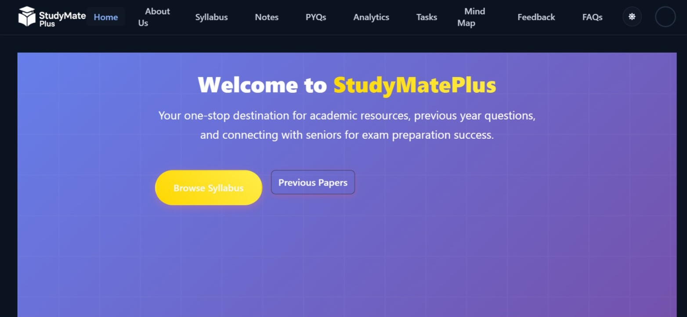
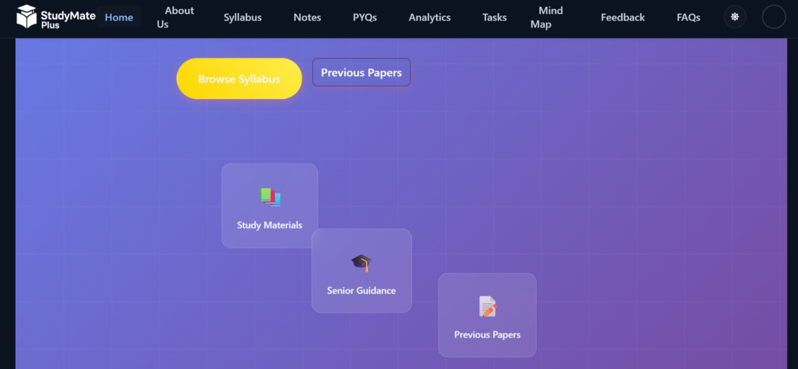
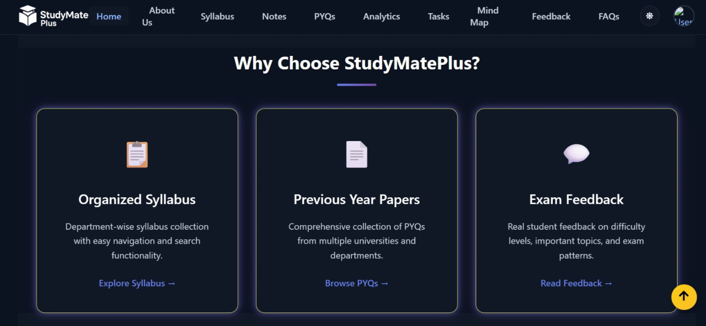
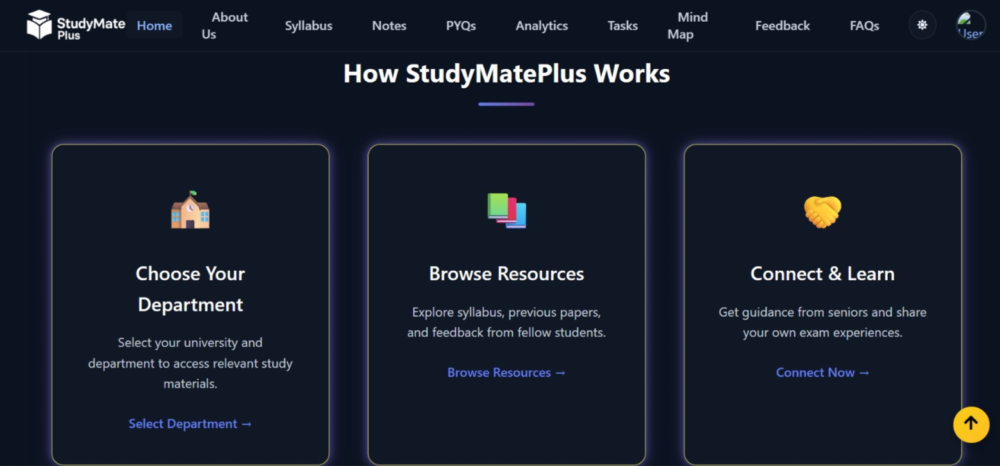

# 📘 StudyMatePlus

🔗 **Live Website**: [https://studymateplus.vercel.app](https://studymateplus.vercel.app)

**StudyMatePlus** is an open-source platform designed to help college students access academic resources such as **syllabus**, **previous year question papers (PYQs)**, and **exam feedback**, along with an option to connect with **seniors** for guidance.
The goal is to support students during exam preparation by providing a centralized, reliable, and user-friendly resource hub.

---

## 🎯 Project Objective

Students often face difficulty finding authentic academic materials in one place. Information like syllabus PDFs, PYQs, and exam tips are scattered or unavailable. This project aims to build a platform that:

* Organizes syllabus and PYQs department-wise
* Includes student feedback on exam papers (e.g., difficulty levels, important topics)
* Connects juniors with seniors for mentoring and doubt clearing
* Supports **multiple universities and departments** in one place

---

## 🌟 Key Features

## 🌟 Features

- 📚 Filter syllabus and papers by university, semester, subject
- 💬 Student feedback section for each paper
- 🤝 Senior-student mentoring and doubt clearing
- 📤 Upload and browse notes and important questions
- 📱 Clean and mobile-friendly interface

---

## 📸 Screenshots

### 🏠 Homepage


### ✨ Features


### 🤔 Why Choose StudyMatePlus?


### ⚙️ How It Works

## 🛠️ Tech Stack

---

| Area           | Technology                         |
| -------------- | ---------------------------------- |
| Frontend       | React.js / Next.js                 |
| Backend        | Node.js / Express / Firebase       |
| Database       | MongoDB / Firebase Firestore       |
| Authentication | Google / University Email Login    |
| Real-time      | Socket.io / Firebase Realtime DB   |
| Hosting        | Netlify / Vercel / Heroku / Render |

---

## 📁 Project Structure (To Be Followed)

```
StudyMatePlus/
├── client/                # Frontend code
├── server/                # Backend code
├── docs/                  # Diagrams, mockups
├── .github/               # Issue templates, PR templates
├── README.md
├── CONTRIBUTING.md
├── LICENSE
└── .env.example
```

---

## 💻 Getting Started

### 1. Fork the Repository

Click on the **Fork** button on the top-right corner of this page to create your own copy.

### 2. Clone Your Fork

```bash
git clone https://github.com/your-username/StudyMatePlus.git
cd StudyMatePlus
```

### 3. Install Dependencies

To install the required dependencies, run the following commands:

```bash
npm install         # Install server-side dependencies
cd client
npm install         # Install frontend (React) dependencies
```

### 4. Configure Environment Variables

Create a `.env` file in both the root and `client/` directories using the `.env.example` file provided as a reference.

Update values like your MongoDB URI and secret keys.
Example
```bash
PORT=5000
MONGO_URI=your-mongodb-uri-here
JWT_SECRET=your-secret-key-here
```

### 5. Run the Application

Start both the backend and frontend:

```bash
# Terminal 1
npm run dev         # Runs server on localhost:5000 (or your preferred port)

# Terminal 2
cd client
npm start           # Runs React frontend on localhost:3000
```

---

## 🧑‍💻 How to Contribute

We welcome contributors of **all experience levels**, especially **beginners** participating through **GirlScript Summer of Code (GSSoC) 2025** and beyond.

Follow the steps below to begin your contribution journey:

### 📄 Step 1: Read the Guidelines

* 📘 Read our [README.md](./README.md)
* 📚 Go through the [CONTRIBUTING.md](./CONTRIBUTING.md)
* 🤝 Understand our [Code of Conduct](./CODE_OF_CONDUCT.md)

### 🌐 Step 2: Choose an Issue

* Check the **Issues** tab for `good first issue` labels
* Comment on the issue you want to work on
* Wait for the maintainers to assign you the issue

### 🔧 Step 3: Make Your Changes

* Create a new branch: `git checkout -b feature-name`
* Make your changes
* Run tests and ensure everything works smoothly

### 📤 Step 4: Submit a Pull Request

* Push your changes: `git push origin feature-name`
* Open a Pull Request (PR) from your forked repository
* Link the issue number in your PR description

---

## 🙌 Code of Conduct

We follow a [Contributor Covenant](https://www.contributor-covenant.org/) to ensure a welcoming environment for everyone.

---

## 📜 License

This project is licensed under the [MIT License](./LICENSE).

---

## 📞 Contact & Community

For queries or discussions:

* Contact me on LinkedIn (https://www.linkedin.com/in/lovely-mahour-992316265/)
* Follow project updates in Issues and Discussions tab

Let's build a student-friendly platform together! 🚀
